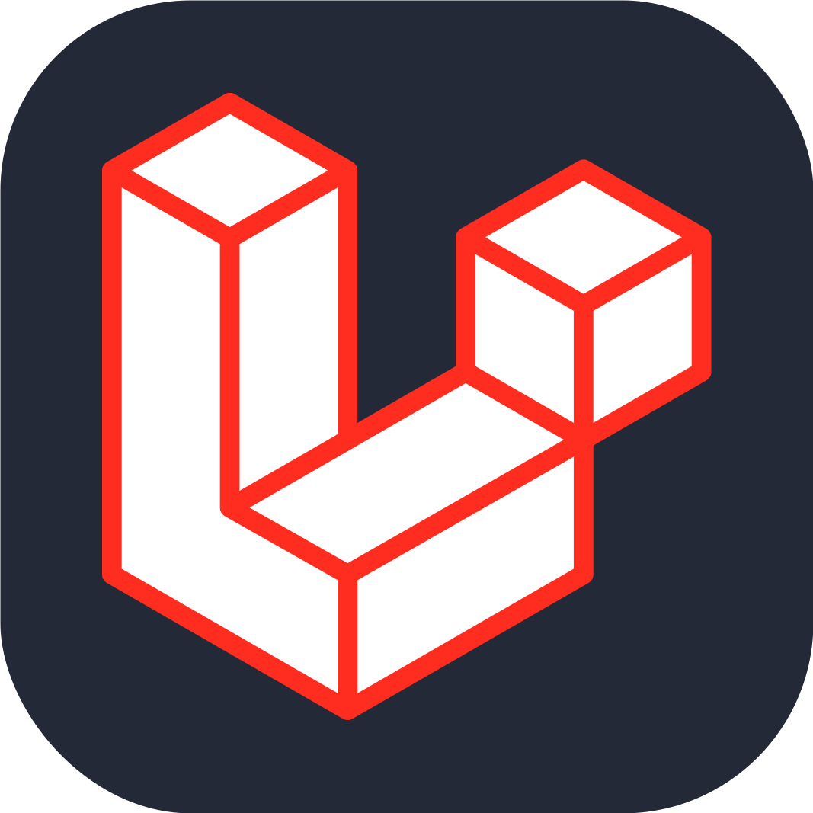

  <h1 align="center">Hey there, I'm Akash Kumar </h1>

    

***
## About Me

* 🎓 3rd year Engineering student diving deep into the tech world
* 💻 Passionate about all things CS, IT, and especially cybersecurity
* Always tinkering with new technologies and building cool stuff
* 🔒 Love playing with security tools like Nmap, Wireshark, and Burp Suite
* Linux enthusiast and proud Arch user (yeah, I had to mention it 😉)
* Currently exploring new tech and sharpening my dev skills

***
## My favorite tools and technologies ⚙️

> Tools and technologies that I have worked with and interested in

<table>
  <tr>
    <td align="center" width="96">
        
       C
    </td>
    <td align="center" width="96">
        
       C++
    </td>
    <td align="center" width="96">
        
       JAVA
    </td>
    <td align="center" width="96">
        
       Python
    </td>
    <td align="center" width="96">
        
       JavaScript
    </td>
    <td align="center" width="96">
        
       TypeScript
    </td>
    <td align="center" width="96">
        
       php
    </td>
    <td align="center" width="96">
        
       Node.js
    </td>
    <td align="center" width="96">
        
       Prisma
    </td>
  </tr>
  <tr>
    <td align="center" width="96">
        
       MySQL
    </td>
    <td align="center" width="96">
        
       MongoDB
    </td>
    <td align="center" width="96">
        
       Redis
    </td>
    <td align="center" width="96">
        
       React
    </td>
    <td align="center" width="96">
        
       NextJS
    </td>
    <td align="center" width="96">
        
       Laravel
    </td>
    <td align="center" width="96">
        
       Websocket
    </td>
    <td align="center" width="96">
        
       WebRTC
    </td>
    <td align="center" width="96">
        
       Postman
    </td>
  </tr>
  <tr>
    <td align="center" width="96">
        
       Docker
    </td>
    <td align="center" width="96">
        
       Kubernetes
    </td>
    <td align="center" width="96">
        
       Git
    </td>
    <td align="center" width="96">
        
       AWS
    </td>
    <td align="center" width="96">
        
       GCP
    </td>
    <td align="center" width="96">
        
       Arch Linux
    </td>
    <td align="center" width="96">
        
       Kali
    </td>
    <td align="center" width="96">
        
       wireshark
    </td>
    <td align="center" width="96">
        
       Burpsuite
    </td>
  </tr>
  <tr>
    <td align="center" width="96">
        
       Nmap
    </td>
    <td align="center" width="96">
        
       Metasploit
    </td>
  </tr>
</table>

  

  

  

