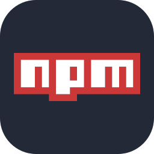
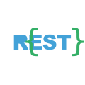

  <h1 align="center">Hey there, I'm Akash Kumar </h1>

    

***
## About Me:

2nd year Engineering student with a passion for CS, IT, and especially cybersecurity. I've honed my skills in the MERN stack and actively explore diverse technologies. In cybersecurity, I'm well-versed in Nmap, Wireshark, Burp Suite, and various pentesting tools. A big fan of the Linux kernel, particularly Kali Linux.

***
## My favorite tools and technologies ⚙️

> Tools and technologies that I have worked with and interested in

<table>
  <tr>
  <td align="center" width="96">
        
       C
    </td>
    <td align="center" width="96">
        
       C++
    </td>
    <td align="center" width="96">
        
       JAVA
    </td>
        <td align="center" width="96">
        
       Python
    </td>
    <td align="center" width="96">
        
       JavaScript
    </td>
    <td align="center" width="96">
        
       MySQL
    </td>
    <td align="center" width="96">
        
       MongoDB
    </td>
    <td align="center" width="96">
        
       TypeScript
    </td>
    <td align="center" width="96">
        
       npm
    </td>
  </tr>
  <tr>
    <td align="center" width="96">
        
       HTML
    </td>
    <td align="center" width="96">
        
       CSS
    </td>
    <td align="center" width="96">
        
       Bootstrap
    </td>
    <td align="center" width="96">
        
       Node.js
    </td>
    <td align="center" width="96">
        
       Express
    </td>
    <td align="center" width="96">
        
       React
    </td>
    <td align="center" width="96">
        
       REST API
    </td>
    <td align="center" width="96">
        
       MaterialUI
    </td>
    <td align="center" width="96">
        
       NextJS
    </td>
 </tr>
 <tr>
    <td align="center" width="96">
        
       Github
    </td>
    <td align="center" width="96">
        
       Kali
    </td>
    <td align="center" width="96">
        
       Ubuntu
    </td>
    <td align="center" width="96">
        
       LinuxMint
    </td>
    <td align="center" width="96">
        
       Windows
    </td>
    <td align="center" width="96">
        
       Debian
    </td>
    <td align="center" width="96">
        
       RedHat
    </td>
    <td align="center" width="96">
        
       Git
    </td>
    <td align="center" width="96">
        
       GCP
    </td>
 </tr>
 <tr>
    <td align="center" width="96">
        
       Wordpress
    </td>
    <td align="center" width="96">
        
       Heroku
    </td>
    <td align="center" width="96">
        
       VSCodium
    </td>
    <td align="center" width="96">
        
       Vite
    </td>
    <td align="center" width="96">
        
       Postman
    </td>
    <td align="center" width="96">
        
       Aircrack-ng
    </td>
    <td align="center" width="96">
        
       wireshark
    </td>
    <td align="center" width="96">
        
       Burpsuite
    </td>
    <td align="center" width="96">
        
       Nmap
    </td>
 </tr>
 <tr>
    <td align="center" width="96">
        
       Metasploit
    </td>
    <td align="center" width="96">
        
       JohnTheRipper
    </td>
    <td align="center" width="96">
        
       GNOME
    </td>
    <td align="center" width="96">
        
       Hydra
    </td>
 </tr>
</table>
